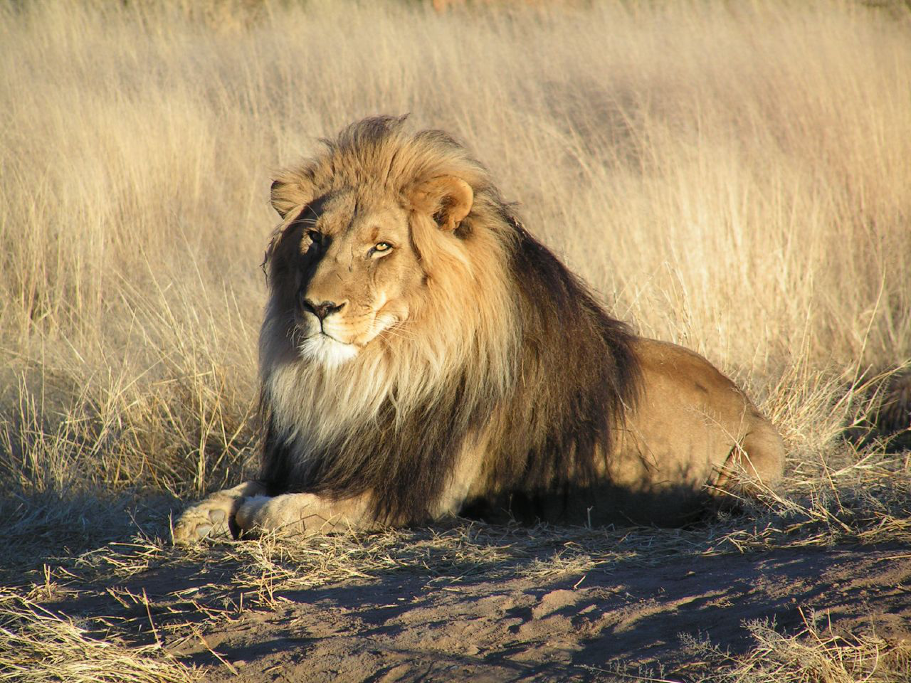

<!-- README.md is generated from README.Rmd. Please edit that file -->

<!-- badges: start -->

[](https://codecov.io/gh/VictorSuarezL/imaggar?branch=master)
[](https://travis-ci.org/VictorSuarezL/imaggar.svg?branch=master)
<!-- badges: end -->

# imaggar

R client for accessing IMAGGA’s REST API.

## Installation

You can install the released version of imaggar from
[CRAN](https://CRAN.R-project.org) with:

``` r
install.packages("imaggar")
```

And the development version from [GitHub](https://github.com/) with:

``` r
# install.packages("devtools")
devtools::install_github("VictorSuarezL/imaggar")
```

## Tagger Example

This is a basic example which shows you how to use `ima_tag` function:



With the code below we call IMAGGA API to tag the lion image:

``` r
library(imaggar)

api_key <- "xxx_f0273ebca9e09dc"
api_secret <- "xxx40eed126f1870dc3736063f546b83"

image_path <- "https://upload.wikimedia.org/wikipedia/commons/7/73/Lion_waiting_in_Namibia.jpg"

ima_tag(image_path, api_key = api_key, api_secret = api_secret)
```

    #> # A tibble: 81 x 4
    #>    result.tags.confidence result.tags.tag.en status.text status.type
    #>                     <dbl> <chr>              <fct>       <fct>      
    #>  1                  100   lion               ""          success    
    #>  2                  100   big cat            ""          success    
    #>  3                  100   feline             ""          success    
    #>  4                   85.4 cat                ""          success    
    #>  5                   74.0 predator           ""          success    
    #>  6                   73.4 wildlife           ""          success    
    #>  7                   69.7 carnivore          ""          success    
    #>  8                   66.5 wild               ""          success    
    #>  9                   64.8 safari             ""          success    
    #> 10                   58.9 mammal             ""          success    
    #> # … with 71 more rows
